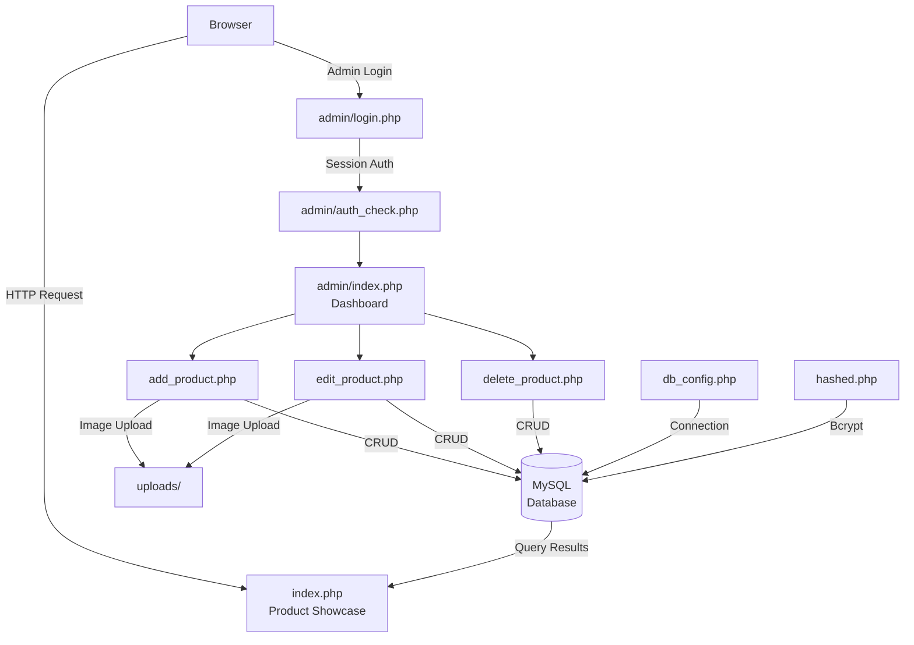

# Pocketphone


A comprehensive phone inventory management system with a secure admin panel and dynamic product showcase.

## Architecture



## Features

### Secure Authentication
Robust login system with password encryption and session management for maximum security

### Role-Based Access
Different access levels for demo and admin users with appropriate permissions

### Product Management
Complete CRUD operations for phone products with image handling

## Technology Stack

- **PHP** - Server-side scripting
- **MySQL** - Database management
- **JavaScript** - Client-side interactivity
- **HTML5** - Structure
- **CSS3** - Styling
- **Session Management** - User authentication
- **Password Encryption** - Security

## Project Structure

```
pocketphone/
├── index.php              # Main front-end page
├── hashed.php            # Password hashing utility
│
├── admin/                # Admin Panel Directory
│   ├── index.php         # Admin dashboard
│   ├── add_product.php   # Product addition interface
│   ├── edit_product.php  # Product editing interface
│   ├── delete_product.php # Product deletion handler
│   ├── auth_check.php    # Authentication middleware
│   ├── db_config.php     # Database configuration
│   ├── login.php         # Admin login interface
│   ├── logout.php        # Session cleanup
│   └── style.css         # Admin panel styling
│
└── uploads/              # Product image storage
```

## Security Implementation

Security is a top priority in this admin panel:

- **Authentication:** Session-based user authentication with secure login/logout
- **Password Security:** All passwords are hashed before storage in the database
- **Data Protection:** Prepared statements prevent SQL injection attacks
- **Input Validation:** All user inputs are validated and sanitized
- **XSS Prevention:** Output escaping prevents cross-site scripting

## Contributing

See [CONTRIBUTING.md](CONTRIBUTING.md) for guidelines.

## Security

See [SECURITY.md](SECURITY.md) for responsible disclosure policy.

## License

This project is licensed under the [MIT License](LICENSE).
