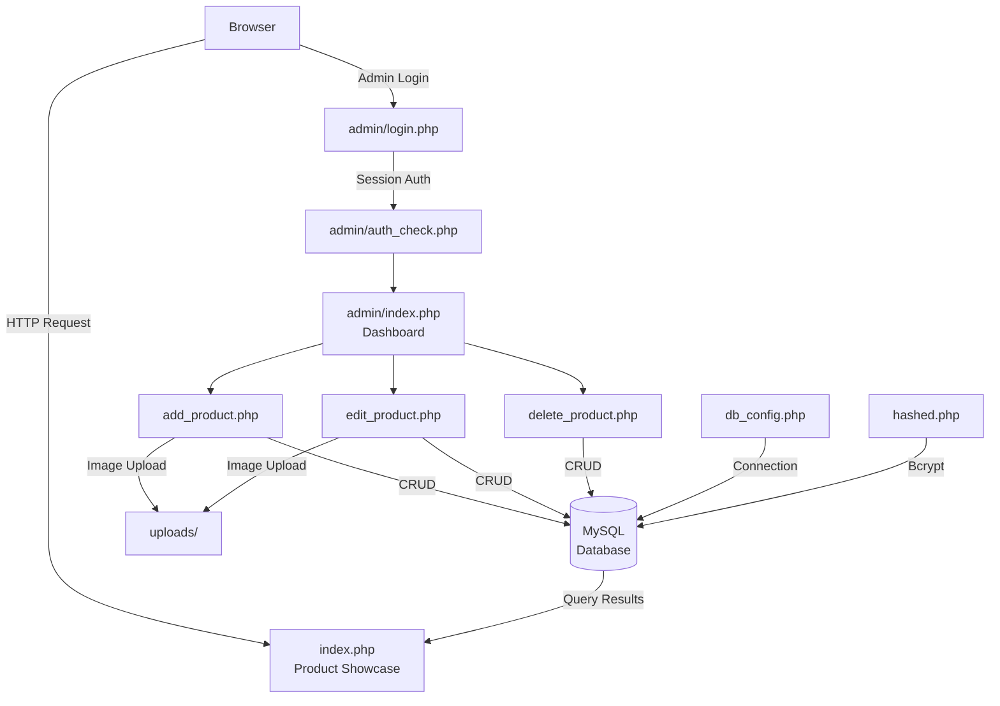
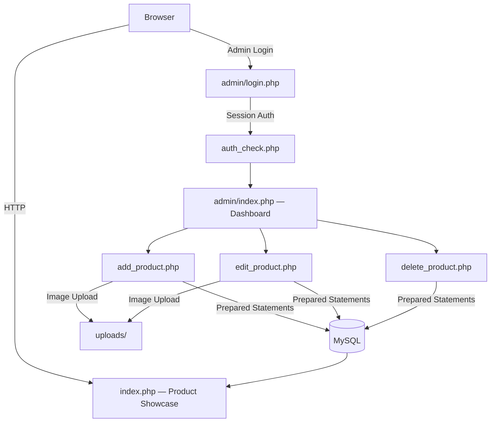

# Pocketphone


A comprehensive phone inventory management system with a secure admin panel and dynamic product showcase.

## Architecture



## Features

### Secure Authentication
Robust login system with password encryption and session management for maximum security

### Role-Based Access
Different access levels for demo and admin users with appropriate permissions

### Product Management
Complete CRUD operations for phone products with image handling

## Technology Stack

- **PHP** - Server-side scripting
- **MySQL** - Database management
- **JavaScript** - Client-side interactivity
- **HTML5** - Structure
- **CSS3** - Styling
- **Session Management** - User authentication
- **Password Encryption** - Security

## Project Structure

```
pocketphone/
├── index.php              # Main front-end page
├── hashed.php            # Password hashing utility
│
├── admin/                # Admin Panel Directory
│   ├── index.php         # Admin dashboard
│   ├── add_product.php   # Product addition interface
│   ├── edit_product.php  # Product editing interface
│   ├── delete_product.php # Product deletion handler
│   ├── auth_check.php    # Authentication middleware
│   ├── db_config.php     # Database configuration
│   ├── login.php         # Admin login interface
│   ├── logout.php        # Session cleanup
│   └── style.css         # Admin panel styling
│
└── uploads/              # Product image storage
```

## Security Implementation

Security is a top priority in this admin panel:

- **Authentication:** Session-based user authentication with secure login/logout
- **Password Security:** All passwords are hashed before storage in the database
- **Data Protection:** Prepared statements prevent SQL injection attacks
- **Input Validation:** All user inputs are validated and sanitized
- **XSS Prevention:** Output escaping prevents cross-site scripting

## Case Study

### Problem

Small phone retailers typically manage inventory in spreadsheets or handwritten ledgers. This leads to pricing errors, duplicate entries, no image tracking, and zero access control — anyone with the spreadsheet can modify records.

### Solution

PocketPhone provides a web-based inventory management system with a dedicated admin panel. Retailers can add, edit, and delete products with images through a clean interface. A public-facing showcase page displays the current inventory to customers automatically.

### Architecture

The system follows a traditional PHP MVC-like pattern:



- **Authentication layer** (`auth_check.php`) guards all admin routes via PHP sessions
- **Database layer** (`db_config.php`) centralizes connection logic with UTF-8 support
- **File uploads** are stored on disk in `uploads/` with validation

### Security Considerations

- Passwords are hashed with `password_hash()` (bcrypt) — never stored as plaintext
- All SQL queries use prepared statements to prevent injection
- Output is escaped with `htmlspecialchars()` to prevent XSS
- Session-based authentication with proper logout (session destruction)
- File upload validation checks type and size before storage

### Lessons Learned

- **Separation of concerns**: Even without a framework, keeping auth, config, and CRUD in separate files made the codebase manageable
- **Prepared statements from day one**: Retrofitting SQL injection prevention is harder than building it in
- **Bcrypt over MD5/SHA**: Using PHP's built-in `password_hash()` is simpler AND more secure than rolling custom hashing
- **Image storage**: Storing on disk with DB references is simpler than BLOB storage for a small-scale app

See [docs/architecture.md](docs/architecture.md) for a deeper dive into the system components.

## Contributing

See [CONTRIBUTING.md](CONTRIBUTING.md) for guidelines.

## Security

See [SECURITY.md](SECURITY.md) for responsible disclosure policy.

## License

This project is licensed under the [MIT License](LICENSE).
