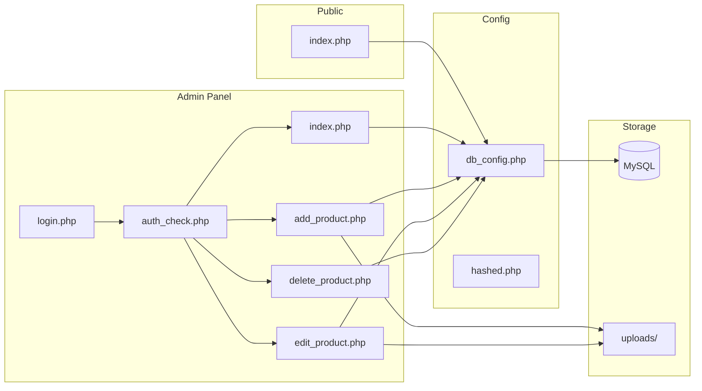
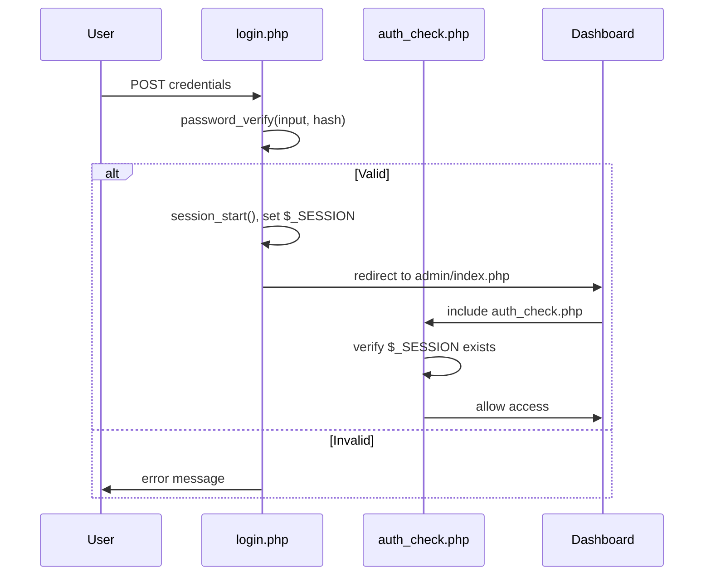

# PocketPhone — Architecture

## System Overview

PocketPhone is a PHP/MySQL inventory management application with two interfaces:

1. **Public showcase** (`index.php`) — read-only product listing for customers
2. **Admin panel** (`admin/`) — authenticated CRUD interface for store managers

## Component Diagram

## Data Flow

### Product Creation

1. Admin authenticates via `login.php` → session created
2. `auth_check.php` validates session on every admin page load
3. Admin fills form on `add_product.php` (name, price, description, image)
4. Server validates input, moves uploaded image to `uploads/`
5. Prepared INSERT statement writes to MySQL `products` table
6. Admin is redirected to dashboard with success message

### Product Display (Public)

1. `index.php` queries all products via `db_config.php` connection
2. Results are looped and rendered as HTML cards with escaped output
3. Product images are served from `uploads/` directory

## Authentication Flow

## Database Schema

The application uses a single `products` table:

| Column | Type | Description |
|--------|------|-------------|
| id | INT AUTO_INCREMENT | Primary key |
| name | VARCHAR | Product name |
| price | DECIMAL | Product price |
| description | TEXT | Product details |
| image | VARCHAR | Filename in uploads/ |

Admin credentials are stored in a separate `users` table with bcrypt-hashed passwords.

## Security Architecture

| Threat | Mitigation |
|--------|-----------|
| SQL Injection | Prepared statements (`mysqli::prepare`) throughout |
| XSS | `htmlspecialchars()` on all output |
| Session Hijacking | Session regeneration on login |
| Brute Force | Password hashing with bcrypt (`password_hash`) |
| File Upload Attacks | Type/size validation before `move_uploaded_file()` |
| Direct File Access | `auth_check.php` included at top of every admin page |

## Deployment

The application runs on any LAMP/WAMP/XAMPP stack:

1. Copy files to web server document root
2. Create MySQL database and import schema
3. Update `admin/db_config.php` with database credentials
4. Ensure `uploads/` directory is writable by the web server
